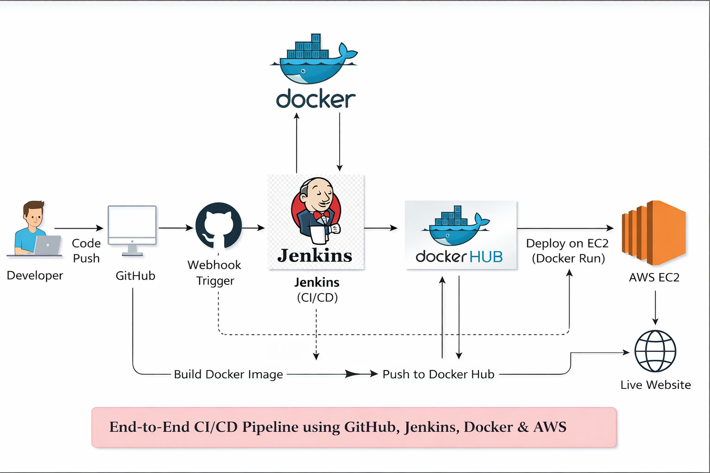
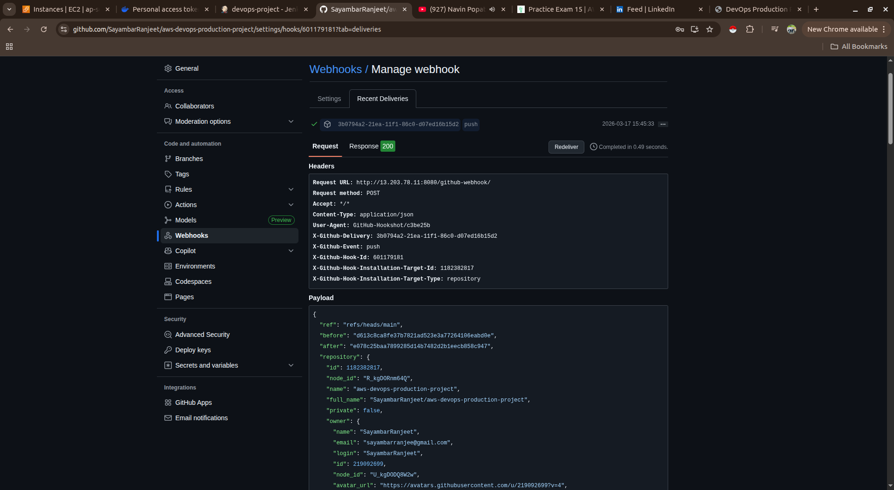
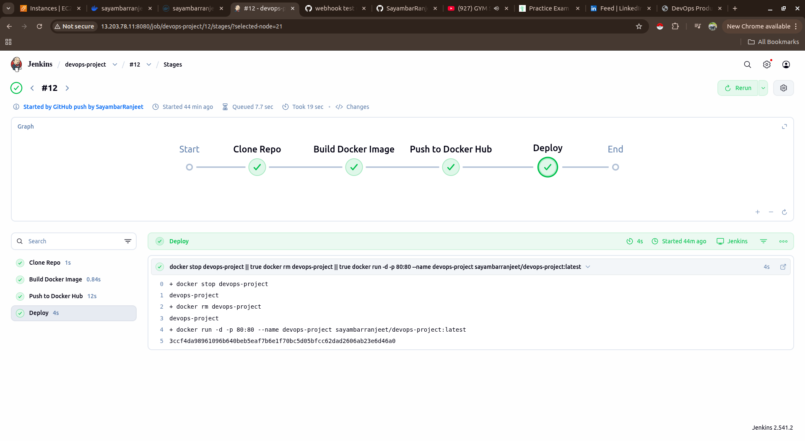
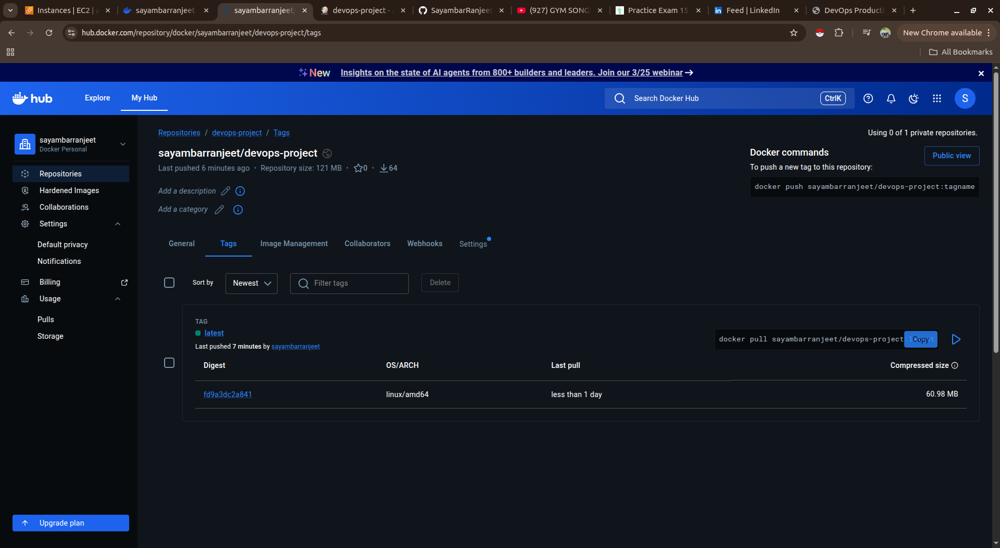
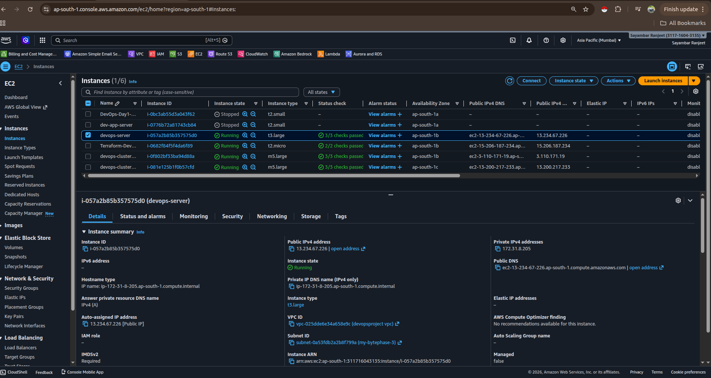
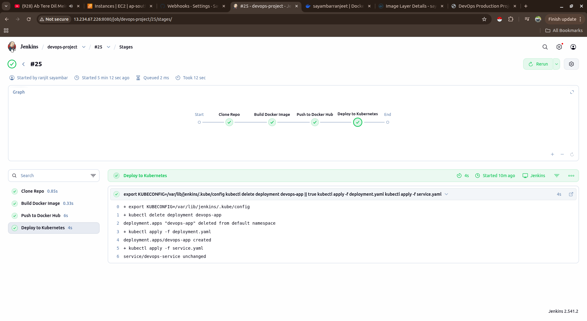
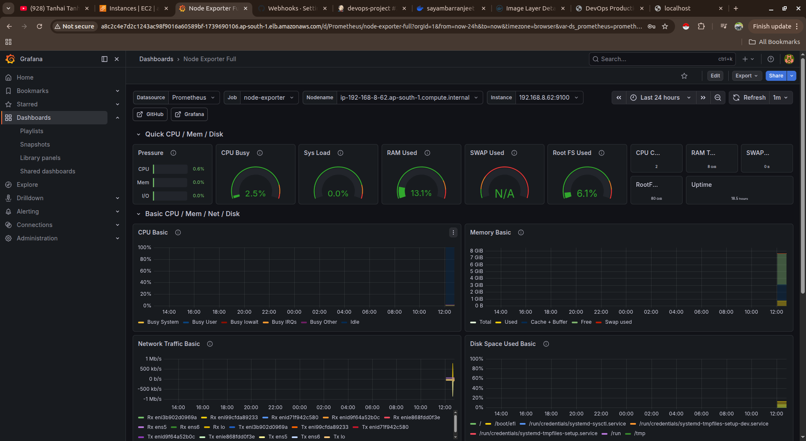
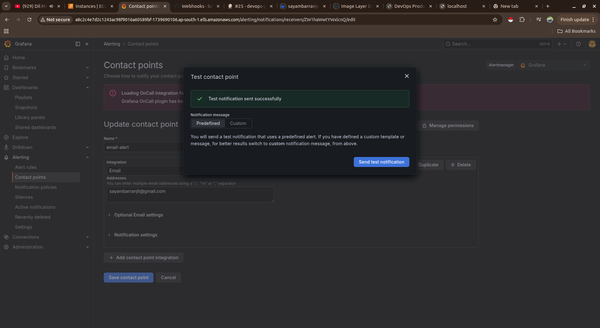
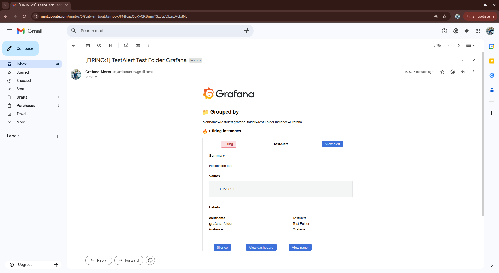

# 🚀 End-to-End CI/CD Pipeline using GitHub, Jenkins, Docker, AWS EC2 & EKS

I designed and implemented a complete DevOps CI/CD pipeline that automates the workflow from code commit to deployment and monitoring.

---

## 🏗️ Architecture

---

## 🔄 CI/CD Workflow

### 🔹 Webhook Trigger

### 🔹 Jenkins Pipeline Execution

---

## 🐳 Docker & Image Management

---

## ☁️ Deployment

### 🔹 EC2 Deployment

### 🔹 Kubernetes Deployment (EKS)

---

## 📊 Monitoring (Prometheus & Grafana)

### 🔹 Dashboard Overview

### 🔹 CPU Monitoring

---

## 🚨 Alerting System

### 🔹 Alert Configuration

### 🔹 Email Notification

---

## 📂 Kubernetes Configuration Files

- deployment.yaml
- service.yaml

---

## ⚙️ Tools & Technologies

- GitHub
- Jenkins
- Docker
- Docker Hub
- AWS EC2
- Amazon EKS
- Kubernetes
- Prometheus
- Grafana

---

## 🎯 Key Features

✔ Automated CI/CD pipeline  
✔ Docker-based deployment  
✔ Kubernetes orchestration  
✔ Real-time monitoring  
✔ Email alerting system  
✔ Zero manual deployment  

---

## 📚 What I Learned

- End-to-end CI/CD pipeline implementation  
- Jenkins automation with Docker  
- Kubernetes deployment on AWS EKS  
- Monitoring using Prometheus & Grafana  
- Real-world DevOps workflow  

---

# 🔥 Author

Ranjeet Sayambar
